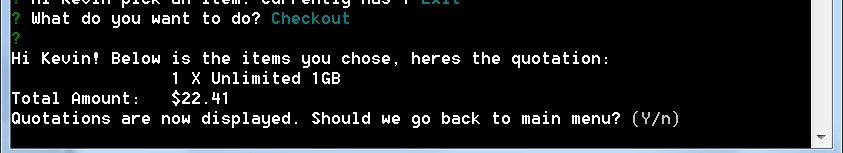

# Amaysim Shopping Cart
A typescript-based nodejs example application for implementing a shopping cart of SIM Cards

### Prerequisites

Node JS version 6.10.3

### Installing

1.) Install a NodeJS version 6.10.3 on your desktop
2.) Clone the repository 
3.) On the project directory. Open a console and type:

```
 npm install
```

### Running

1.) Type the following to run:

```
npm run start
```

or 

```
node index
```
2.) A command-line will appear on your screen


3.) Key in your name and the promo you want to enable


4.) Once you put all the promo configurations, the main dashboard will appear


5.) When you pick 'Add Items', the prompt will let you choose what you want to add in your cart

and you can also add a promo code


6.) When you want to see the cart price, Select 'Checkout' option in the main dashboard


7.) A listing of all the products and its quotations will appear.


### Testing
Mocha Test Runner is the default testing framework used in this application. To start the mocha runner, key in:

```
npm run test
```
or if you will use IDEs (such as IntelliJ - to debug):

```
mocha  -r ts-node/register -r tsconfig-paths/register test/**/*.test.ts
```

## Deployment

Add additional notes about how to deploy this on a live system

## Built With

* [Typescript](https://github.com/Microsoft/TypeScript/) - web framework used
* [Mocha](https://github.com/mochajs/mocha) - testing framework used
* [Inquirer](https://github.com/SBoudrias/Inquirer.js/) - command-line UI used

## Authors

* **Kevin de Guzman** - [kevde](https://github.com/kevde)